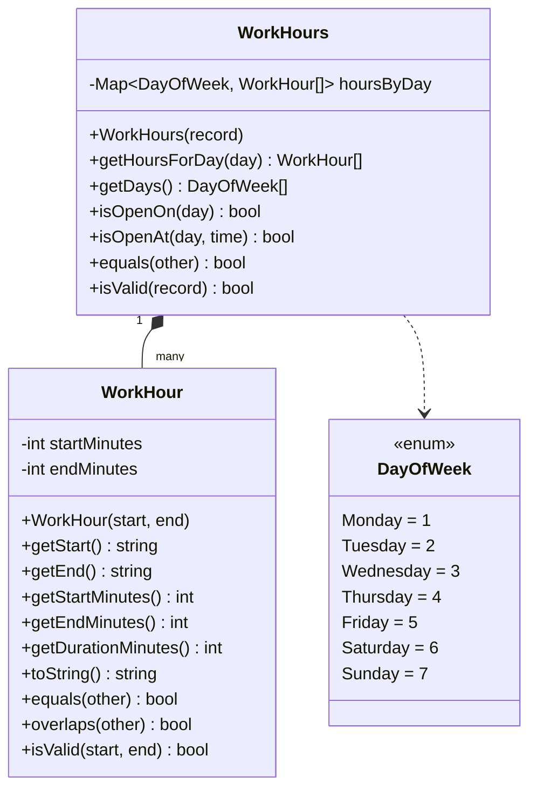

# Дизайн value objects: WorkHour и WorkHours

## Контекст

`ServiceObject` (объект обслуживания) должен хранить график работы. Для этого вводим два value object:

- **`WorkHour`** — один временной диапазон работы в течение дня (например, `09:00–18:00).
- **`WorkHours`** — все часы работы на неделю (набор диапазонов по дням недели).

Оба класса следуют устоявшимся конвенциям проекта (см. [`address.ts`](Tickets/src/Tickets.Domain/vo/address.ts:1), [`coords.ts`](Tickets/src/Tickets.Domain/vo/coords.ts:1), [`phone-number.ts`](Tickets/src/Tickets.Domain/vo/phone-number.ts:1)):
- приватные `readonly` поля;
- валидация в конструкторе с выбросом `Error` с русским сообщением;
- методы `getValue()`/геттеры, `toString()`, `equals()`, статический `isValid()`.

## Ключевое решение: представление времени

Время храним как **целое число минут от полуночи** (`0..1439`). Это:
- исключает проблемы часовых поясов и `Date` (график работы не зависит от даты);
- даёт точное сравнение и проверку пересечений;
- легко форматируется в `HH:MM` и парсится из строки.

Внешний интерфейс принимает/отдаёт строки формата `HH:MM` (24-часовой формат).

## WorkHour

Один временной диапазон.

```ts
// vo/work-hour.ts
export class WorkHour {
  private readonly startMinutes: number; // 0..1439
  private readonly endMinutes: number;   // 1..1440 (end может быть 1440 = 24:00)

  constructor(start: string, end: string); // "HH:MM"
  // или
  static fromMinutes(start: number, end: number): WorkHour;

  getStart(): string;      // "HH:MM"
  getEnd(): string;        // "HH:MM"
  getStartMinutes(): number;
  getEndMinutes(): number;
  getDurationMinutes(): number;
  toString(): string;      // "HH:MM-HH:MM"
  equals(other: WorkHour): boolean;
  overlaps(other: WorkHour): boolean;
  static isValid(start: string, end: string): boolean;
  static isValidMinutes(start: number, end: number): boolean;
}
```

### Правила валидации
- `start` и `end` — строки формата `HH:MM`, где `HH` в `00..23`, `MM` в `00..59`.
- `startMinutes < endMinutes` (диапазон непустой).
- `endMinutes` может быть `1440` (соответствует `24:00`), чтобы покрыть работу до полуночи.
- `startMinutes` в `0..1439`.

### Примеры
- `new WorkHour('09:00', '18:00')` — рабочий день 9:00–18:00.
- `new WorkHour('00:00', '24:00')` — круглосуточно.
- `new WorkHour('18:00', '09:00')` — ошибка (start >= end).

## WorkHours

Набор диапазонов по дням недели. День недели задаётся ISO-номером: `1 = Пн ... 7 = Вс`.

```ts
// vo/work-hours.ts
export enum DayOfWeek {
  Monday = 1,
  Tuesday = 2,
  Wednesday = 3,
  Thursday = 4,
  Friday = 5,
  Saturday = 6,
  Sunday = 7,
}

export class WorkHours {
  private readonly hoursByDay: ReadonlyMap<DayOfWeek, readonly WorkHour[]>;

  constructor(hoursByDay: Record<DayOfWeek, WorkHour[]>);
  // или
  static fromMap(hoursByDay: Map<DayOfWeek, WorkHour[]>): WorkHours;

  getHoursForDay(day: DayOfWeek): readonly WorkHour[];
  getDays(): DayOfWeek[];                       // дни, в которые есть работа
  isOpenOn(day: DayOfWeek): boolean;            // есть ли работа в этот день
  isOpenAt(day: DayOfWeek, time: string): boolean; // работает ли в указанное время "HH:MM"
  equals(other: WorkHours): boolean;
  static isValid(hoursByDay: Record<DayOfWeek, WorkHour[]>): boolean;
}
```

### Правила валидации
- Хотя бы один день недели должен иметь хотя бы один `WorkHour`.
- В пределах одного дня диапазоны не должны пересекаться (проверка через `WorkHour.overlaps`).
- Диапазоны в пределах дня хранятся отсортированными по `startMinutes`.
- День с пустым массивом диапазонов трактуется как выходной (не добавляется в карту).

### Примеры
```ts
const wh = new WorkHours({
  [DayOfWeek.Monday]: [new WorkHour('09:00', '18:00')],
  [DayOfWeek.Tuesday]: [new WorkHour('09:00', '13:00'), new WorkHour('14:00', '18:00')], // обед
  [DayOfWeek.Saturday]: [new WorkHour('10:00', '16:00')],
});

wh.isOpenOn(DayOfWeek.Monday);   // true
wh.isOpenAt(DayOfWeek.Monday, '12:00'); // true
wh.isOpenAt(DayOfWeek.Monday, '08:00'); // false
wh.isOpenAt(DayOfWeek.Sunday, '12:00'); // false (выходной)
```

## Интеграция с ServiceObject

Поле `work_hours` добавляется в [`ServiceObject`](Tickets/src/Tickets.Domain/entities/service-object.ts:8) и в [`ServiceObjectCreateData`](Tickets/src/Tickets.Domain/vo/service-object-create-data.ts:5):

```ts
// ServiceObject
private work_hours?: WorkHours;
getWorkHours(): WorkHours | undefined;
```

## Файлы для реализации

| Файл | Назначение |
|------|-----------|
| `Tickets/src/Tickets.Domain/vo/work-hour.ts` | Класс `WorkHour` |
| `Tickets/src/Tickets.Domain/vo/work-hours.ts` | Enum `DayOfWeek` и класс `WorkHours` |
| `Tickets/src/Tickets.Domain/vo/work-hour.spec.ts` | Тесты `WorkHour` |
| `Tickets/src/Tickets.Domain/vo/work-hours.spec.ts` | Тесты `WorkHours` |

## Диаграмма



## Открытые вопросы

1. **Формат входных данных**: принимать время как строки `"HH:MM"` или как числа минут? Предлагаю строки (удобнее для внешнего API), с внутренним хранением в минутах.
2. **Несколько диапазонов в день**: нужна ли поддержка перерывов (несколько диапазонов в один день)? Предлагаю да — это покрывает обеденные перерывы.
3. **Круглосуточный день**: поддерживать ли `24:00` как конец диапазона? Предлагаю да.
4. **Интеграция**: добавлять ли `work_hours` в `ServiceObject` сразу в рамках этой задачи или отдельно?