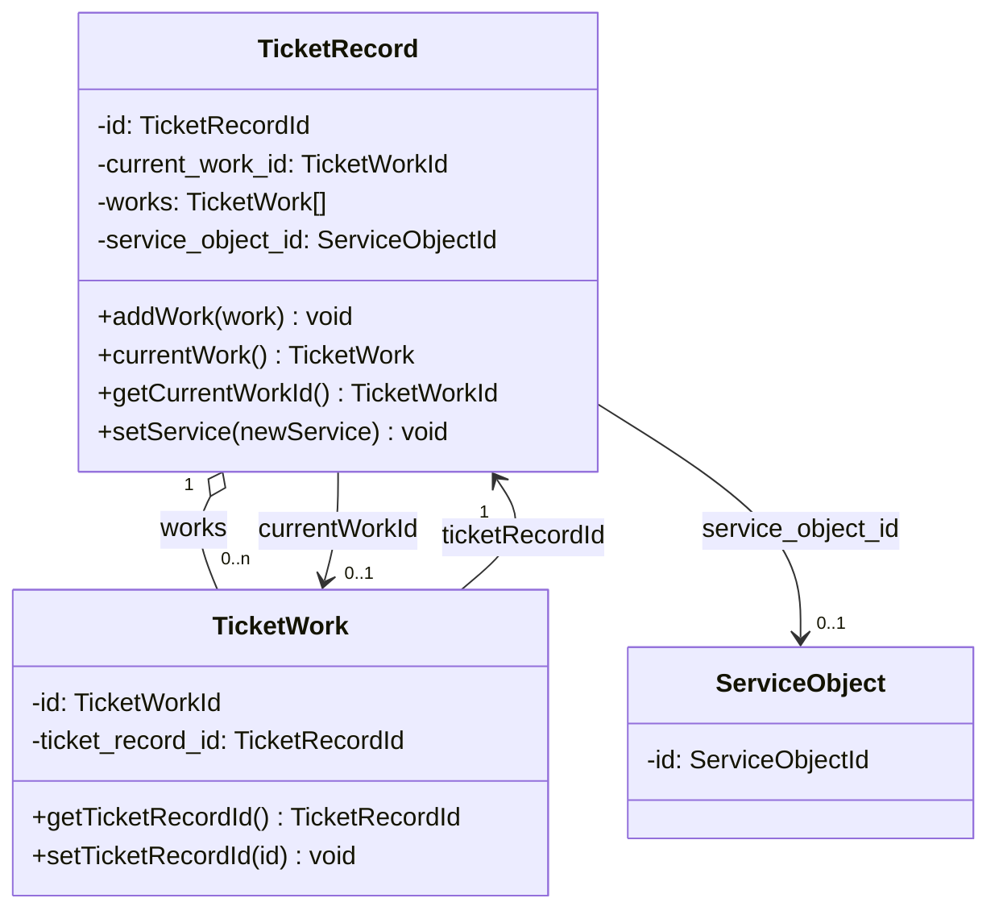

# План: выполнить все шаги раздела «5. Следующий шаг»

> Проект: **Система управления разъездными сотрудниками** (DDD, монorepo ограниченных контекстов).
> Контекст: `Tickets/` (NestJS + CQRS + Sequelize + PostgreSQL + RabbitMQ).
> Источник задачи: [`work/work-progress.md`](work/work-progress.md:61), раздел «5. Следующий шаг».
> Целевое состояние: [`work/02-tactical/aggregate.md`](work/02-tactical/aggregate.md).
> Язык плана: русский (по AGENTS.md).
> Дата создания: 2026-08-20 (Europe/Moscow, UTC+3).

---

## 0. Контекст и цель

Раздел «5. Следующий шаг» из [`work/work-progress.md`](work/work-progress.md:61) требует привести фактический код
`Tickets/src/Tickets.Domain/` к «целевому состоянию», зафиксированному в [`work/02-tactical/aggregate.md`](work/02-tactical/aggregate.md).

Шесть шагов из раздела:

1. Реализовать связь 1:n между агрегатами `TicketRecord` и `TicketWork`: коллекция `TicketWork[]` и понятие активной работы `currentWork()`.
2. Добавить перекрёстные ссылки по ID: `currentWorkId` (в `TicketRecord`) и `ticketRecordId` (в `TicketWork`).
3. Вынести `service_object` из встроенных данных в отдельную сущность `ServiceObject` со ссылкой по ID (с сохранением синхронизации `fromDb()` и `vo/ticket-record-create-data.ts`).
4. Устранить dangling-ссылку `TicketServiceChangedEvent` (используется в `TicketRecord.setService()`, но не определён/импортирован).
5. Заполнить чек-лист из «Полезных замечаний» тактического README.
6. Обновить раздел 2 (статус этапа) и зафиксировать результат в разделе 3 журнала.

> **Важный блокер сборки:** в текущем коде [`entities/ticket-record.ts`](Tickets/src/Tickets.Domain/entities/ticket-record.ts:162)
> вызывается `new TicketServiceChangedEvent(...)`, но класса **не существует** и **не импортирован** — `yarn build` сейчас
> падает с `TS2304 Cannot find name 'TicketServiceChangedEvent'`. Поэтому **шаг 4 нужно выполнить первым** (до запуска `yarn build`),
> чтобы разблокировать сборку, либо собирать/тестировать только после шага 4. В плане принят порядок «4 → 1 → 2 → 3 → 5 → 6»
> (сначала разблокировать сборку, затем модель 1:n и рефакторинг), при этом нумерация шагов сохранена из журнала.

---

## 1. Архитектурная схема целевого состояния

---

## 2. Общие правила выполнения

- Все команды выполняются **из каталога `Tickets/`** (у контекста собственный `package.json`/`yarn.lock`).
- Проверка качества в конце каждой группы шагов (в `Tickets/`):
  - `yarn build` — компиляция TS (сборка сейчас сломана из-за dangling-ссылки, см. раздел 0).
  - `yarn test` — юнит-тесты (testMatch `**/*.spec.ts`, см. [`Tickets/jest.config.js`](Tickets/jest.config.js:7)).
  - `yarn lint` — ESLint (с `--fix`).
- Тесты размещаются **рядом с исходником** (`*.spec.ts`), следуя конвенции: `testMatch` только `**/*.spec.ts`.
- Доменные сообщения об ошибках — **на русском**.
- Идентификаторы создаются только через фабрики `XxxId.from(...)` / проверяются `XxxId.isValid(...)`
  (см. [`entities/identifiers.ts`](Tickets/src/Tickets.Domain/entities/identifiers.ts)).
- Поля БД/DTO — `snake_case`.
- Справочные материалы (чек-лист) сохраняются в `work/02-tactical/`, а **не** в `plans/`.

---

## 3. Подробные шаги

### Шаг 4 (выполнять первым). Устранить dangling-ссылку `TicketServiceChangedEvent`

**Проблема:** в [`entities/ticket-record.ts`](Tickets/src/Tickets.Domain/entities/ticket-record.ts:162) вызывается
`new TicketServiceChangedEvent({ticketId, newService, eventId, occurredAt})`, но класса нет в `domain-events/` и нет импорта.

**Что сделать:**

1. Создать файл `Tickets/src/Tickets.Domain/domain-events/ticket-service-changed-event.ts`:
   - Класс `TicketServiceChangedEvent extends DomainEvent` (как образец — [`ticket-record-assignee-changed-event.ts`](Tickets/src/Tickets.Domain/domain-events/ticket-record-assignee-changed-event.ts)).
   - Поля: `ticketId: string` (тип `TicketRecordId`), `newService: string`.
   - Конструктор принимает `{ ticketId, newService, eventId?, occurredAt? }` и вызывает `super(eventId, occurredAt)`.
   - Экспортировать класс и (опционально) тип данных события `TicketServiceChangedInfo`.
2. В [`entities/ticket-record.ts`](Tickets/src/Tickets.Domain/entities/ticket-record.ts:5) добавить импорт:
   `import { TicketServiceChangedEvent } from "../domain-events/ticket-service-changed-event";`.
3. Убедиться, что вызов в `setService()` ([строка 162](Tickets/src/Tickets.Domain/entities/ticket-record.ts:162))
   согласован с типом конструктора (передаётся `ticketId: this.id` — тип `TicketRecordId`, `newService`).
4. (Опционально, для соответствия Матрице README) при желании позже добавить отдельные
   `TicketServiceExtСhangedEvent`/`TicketServiceByEngineerСhangedEvent`; на этом шаге достаточно минимального класса
   `TicketServiceChangedEvent` (имя из текущего кода).

**Критерии готовности:**
- Файл события существует, наследует `DomainEvent`, экспортирован.
- В `ticket-record.ts` есть импорт; `yarn build` проходит без `Cannot find name 'TicketServiceChangedEvent'`.

**Команды:** из `Tickets/`: `yarn build`.

---

### Шаг 1. Связь 1:n: коллекция `TicketWork[]` и `currentWork()`

**Проблема:** в [`entities/ticket-record.ts`](Tickets/src/Tickets.Domain/entities/ticket-record.ts) нет коллекции работ
и понятия активной работы; `TicketWork` не связан с заявкой.

**Что сделать в [`entities/ticket-record.ts`](Tickets/src/Tickets.Domain/entities/ticket-record.ts):**

1. Импортировать `TicketWork` и `TicketWorkId` из соответствующих файлов.
2. Добавить поле `private works: TicketWork[] = [];`.
3. Добавить метод `addWork(work: TicketWork): void`:
   - Если `work` активна (статус не в `{Done, Canceled, Closed}`) и уже есть активная работа в коллекции — бросить ошибку на русском
     (инвариант «единственная активная работа», `count(activeWorks) <= 1`).
   - Иначе добавить в `this.works`.
4. Добавить метод `currentWork(): TicketWork | undefined`:
   - Возвращает первую работу в коллекции со статусом, **не** входящим в `{Done, Canceled, Closed}`
     (по `TicketWorkStatus`, см. [`vo/ticket-work-status.ts`](Tickets/src/Tickets.Domain/vo/ticket-work-status.ts)).
   - Если активных нет — `undefined`.
5. При необходимости в конструкторе инициализировать `this.works = [...(data.works ?? [])]`
   (см. шаг 2 по расширению `TicketRecordCreateData`).

**Критерии готовности:**
- `TicketRecord` имеет коллекцию работ и метод `currentWork()`, возвращающий активную работу (или `undefined`).
- Инвариант «одна активная работа» защищён в `addWork`.

**Команды:** из `Tickets/`: `yarn build`, `yarn test`, `yarn lint`.

---

### Шаг 2. Перекрёстные ссылки по ID: `currentWorkId` и `ticketRecordId`

**Что сделать:**

1. В [`entities/ticket-record.ts`](Tickets/src/Tickets.Domain/entities/ticket-record.ts):
   - Поле `private current_work_id?: TicketWorkId;`.
   - Геттер `getCurrentWorkId(): TicketWorkId | undefined`.
   - В `addWork(...)` при добавлении **активной** работы присваивать `this.current_work_id = work.getId()`.
   - В `currentWork()`/геттере — держать `current_work_id` согласованным с активной работой коллекции.

2. В [`entities/ticket-work.ts`](Tickets/src/Tickets.Domain/entities/ticket-work.ts):
   - Импортировать `TicketRecordId`.
   - Поле `private ticket_record_id?: TicketRecordId;`.
   - Геттер `getTicketRecordId(): TicketRecordId | undefined`.
   - Сеттер `setTicketRecordId(id: TicketRecordId): void` (или приём через `TicketWorkCreateData`, см. ниже).
   - При необходимости в конструкторе инициализировать `this.ticket_record_id = data.ticketRecordId ? TicketRecordId.from(data.ticketRecordId) : undefined`.

3. В [`vo/ticket-work-create-data.ts`](Tickets/src/Tickets.Domain/vo/ticket-work-create-data.ts):
   - Добавить поле `ticketRecordId?: string` и в конструкторе/типе принять его.

4. В [`vo/ticket-record-create-data.ts`](Tickets/src/Tickets.Domain/vo/ticket-record-create-data.ts):
   - Добавить поле `currentWorkId?: string` (для синхронизации с `fromDb()`, см. шаг 3) и `works?: ...` (коллекция), если это требуется для сборки агрегата.

5. В [`entities/ticket-record.ts`](Tickets/src/Tickets.Domain/entities/ticket-record.ts) `fromDb()`:
   - Маппить `current_work_id` из БД-поля (если есть) в `currentWorkId` у `TicketRecordCreateData`.

**Критерии готовности:**
- `TicketRecord` умеет хранить/отдавать `currentWorkId`.
- `TicketWork` умеет хранить/отдавать `ticketRecordId`.
- `yarn build`, `yarn test`, `yarn lint` проходят.

**Команды:** из `Tickets/`: `yarn build`, `yarn test`, `yarn lint`.

---

### Шаг 3. Вынести `service_object` в отдельную сущность `ServiceObject` со ссылкой по ID

**Проблема:** `TicketRecordCreateData` содержит **встроенный** `service_object` (адрес, имя, поисковый код, координаты, телефон),
а `TicketRecord` вообще не хранит ссылку на объект. Целевое состояние — ссылка по ID на отдельную сущность `ServiceObject`
(см. [`aggregate.md`](work/02-tactical/aggregate.md:72), раздел 1.4: `ServiceObject` — внешняя ссылка на контекст «Координаты»).

**Что сделать:**

1. Сущность [`entities/service-object.ts`](Tickets/src/Tickets.Domain/entities/service-object.ts) **уже существует**
   (приватный конструктор, создание `id` через `uuidv4()`). Добавить **публичную фабрику** для восстановления по существующему ID:
   - `static from(data: ServiceObjectCreateData & { id: string }): ServiceObject` — создаёт экземпляр с заданным `id`
     (вместо генерации нового `uuidv4()`), для чтения из БД/по ссылке.
   - Оставить приватный конструктор; внутри фабрики выполнять `ServiceObjectId.from(id)`.

2. В [`entities/ticket-record.ts`](Tickets/src/Tickets.Domain/entities/ticket-record.ts):
   - Импортировать `ServiceObjectId`.
   - Поле `private service_object_id?: ServiceObjectId;`.
   - Геттер `getServiceObjectId(): ServiceObjectId | undefined`.
   - В конструкторе инициализировать из `data.serviceObjectId ? ServiceObjectId.from(data.serviceObjectId) : undefined`.

3. В [`vo/ticket-record-create-data.ts`](Tickets/src/Tickets.Domain/vo/ticket-record-create-data.ts):
   - **Заменить** встроенный `service_object` (объект с `address/name/search_code/coords/phone_number`) на ссылку
     `serviceObjectId?: string` (по `snake_case` — при необходимости `service_object_id`).
   - Обновить тип данных конструктора, присвоение в конструкторе и валидацию `isValid()` (вместо проверки вложенных полей —
     проверять непустую строку `service_object_id`).
   - **Синхронизировать** с `fromDb()`.

4. В [`entities/ticket-record.ts`](Tickets/src/Tickets.Domain/entities/ticket-record.ts) `fromDb()` ([строки 51–89](Tickets/src/Tickets.Domain/entities/ticket-record.ts:51)):
   - В сигнатуре типа данных заменить `service_object` на `service_object_id: string` (или читать из БД-поля).
   - В `TicketRecordCreateData` передавать `service_object_id: data.service_object_id` вместо встроенного объекта.

5. Проверить все использования `TicketRecordCreateData`/`fromDb` по репозиторию (поиском `service_object`, `TicketRecordCreateData`),
   чтобы после замены поля не осталось обращений к старому встроенному `service_object`.
   - Из найденного ранее: встроенный `service_object` используется только в `ticket-record.ts` (`fromDb`) и в самом
     `vo/ticket-record-create-data.ts`; сторонних потребителей нет. Это упрощает рефакторинг.

**Критерии готовности:**
- `TicketRecordCreateData` хранит ссылку `service_object_id`, а не встроенный объект.
- `TicketRecord` хранит/отдаёт `ServiceObjectId`.
- `ServiceObject` восстановим по ID через фабрику `from(...)`.
- `fromDb()` и `vo/ticket-record-create-data.ts` синхронизированы; нигде в `src/` не осталось старого встроенного `service_object`.
- `yarn build`, `yarn test`, `yarn lint` проходят.

**Команды:** из `Tickets/`: `yarn build`, `yarn test`, `yarn lint`. Перед проверкой — глобальный поиск
`service_object` по `Tickets/src/**/*.ts`, чтобы убедиться в отсутствии остатков.

---

### Шаг 5. Заполнить чек-лист из «Полезных замечаний» тактического README

**Проблема:** «Полезные замечания» из [`work/02-tactical/README.md`](work/02-tactical/README.md:35) не зафиксированы
как проверяемый чек-лист; в [`work-progress.md`](work/work-progress.md:57) это открытый дефект №5.

**Что сделать:**

1. Создать файл `work/02-tactical/checklist.md` (справочный материал — в `work/`, а не в `plans/`).
2. Включить в чек-лист следующие пункты «Полезных замечаний» и отметить статус «выполнено/частично/не выполнено»:
   - Заявка и Работа над заявкой имеют собственные команды и события (отдельные агрегаты).
   - Соотношение 1 : n (одна Заявка — несколько Работ).
   - Заявка может быть переоткрыта несколько раз → несколько экземпляров Работы.
   - В один момент времени Заявка связана с одной активной Работой (`count(activeWorks) <= 1`).
   - Изменения в Заявке применяются к Работе по событию (и обратно) — двустороннее применение, eventual consistency.
   - Заявка хранит ссылку по ID на Работу; Работа хранит ссылку по ID на Заявку (перекрёстные ссылки).
   - И Заявка, и Работа — самостоятельные агрегаты (не внутренние сущности).
3. Для каждого пункта указать ссылку на реализацию (файл/метод) или пометку «целевое состояние» (если реализовано
   частично по коду — как в [`aggregate.md`](work/02-tactical/aggregate.md:226) раздел 7).
4. Обновить раздел 7 «Известные дефекты» в [`aggregate.md`](work/02-tactical/aggregate.md:226) (и/или примечания),
   отметив, что дефекты 1, 3, 4, 5 устранены в рамках этого шага.

**Критерии готовности:**
- Файл `work/02-tactical/checklist.md` создан и заполнен по всем пунктам «Полезных замечаний» с указанием статусов и ссылок.

**Команды:** правка markdown (без `yarn`). Проверка — визуальная.

---

### Шаг 6. Обновить журнал прогресса

**Что сделать в [`work/work-progress.md`](work/work-progress.md):**

1. Раздел 2 «Статус этапов» ([строки 22–29](work/work-progress.md:22)) — для этапа 2 «Тактическое проектирование ядра»:
   - при полном завершении шагов 1–6 — пометить `✅ завершён` (или `🔄` при частичном выполнении) с комментарием.
2. Раздел 4 «Открытые вопросы / блокеры» ([строки 51–57](work/work-progress.md:51)):
   - закрыть (или перевести в «Решён») дефекты №1–№5, которые устранены в ходе шагов 1–5.
3. Раздел 3 «Последние выполненные действия» ([строки 39–45](work/work-progress.md:39)) — добавить запись сверху
   вида: `2026-08-20 — выполнены шаги «5. Следующий шаг»: реализована связь 1:n ..., перекрёстные ссылки ..., вынесен service_object ..., устранена dangling-ссылка ..., заполнен чек-лист ...`.
4. Раздел 5 «Следующий шаг» ([строки 61–70](work/work-progress.md:61)) — отметить выполненные пункты
   (заменить `[ ]` на `[x]`), либо переформулировать следующий шаг (например, «Этап 3: Архитектура приложения и паттерны»),
   если все пункты выполнены.

**Критерии готовности:**
- Разделы 2, 3, 4, 5 журнала отражают фактическое состояние после выполнения шагов 1–5.

**Команды:** правка markdown (без `yarn`). Проверка — визуальная.

---

## 4. Итоговый порядок выполнения и контроль качества

| Порядок | Шаг | Тип работы | Инструмент / режим | Проверка |
|---------|-----|------------|--------------------|----------|
| 1 | Шаг 4 — dangling `TicketServiceChangedEvent` | код (`domain-events/`, `entities/`) | 💻 Code | `yarn build` |
| 2 | Шаг 1 — связь 1:n, `TicketWork[]`, `currentWork()` | код (`entities/`) | 💻 Code | `yarn build`, `yarn test`, `yarn lint` |
| 3 | Шаг 2 — `currentWorkId` / `ticketRecordId` | код (`entities/`, `vo/`) | 💻 Code | `yarn build`, `yarn test`, `yarn lint` |
| 4 | Шаг 3 — вынос `service_object` в `ServiceObject` | код (`entities/`, `vo/`) | 💻 Code | поиск `service_object`; `yarn build`, `yarn test`, `yarn lint` |
| 5 | Шаг 5 — чек-лист «Полезных замечаний» | документация | ✍️ (Code/Architect) | визуальная |
| 6 | Шаг 6 — обновление `work-progress.md` | документация | ✍️ (Code/Architect) | визуальная |

Финальная проверка из `Tickets/`: `yarn build && yarn test && yarn lint`.

---

## 5. Тесты (рекомендуется)

Чтобы закрыть шаги 1–3 юнит-тестами по конвенции проекта (файлы `*.spec.ts` рядом с исходником), добавить:

- `Tickets/src/Tickets.Domain/entities/ticket-record.spec.ts`:
  - `addWork` добавляет работу и единственную активную;
  - `currentWork()` возвращает активную работу (не `Done/Canceled/Closed`);
  - попытка добавить вторую активную работу — ошибка на русском;
  - `getCurrentWorkId()` возвращает `TicketWorkId` активной работы.
- `Tickets/src/Tickets.Domain/entities/ticket-work.spec.ts`:
  - `setTicketRecordId`/`getTicketRecordId` — ссылка по ID на заявку.
- `Tickets/src/Tickets.Domain/domain-events/ticket-service-changed-event.spec.ts` (опционально):
  - конструктор корректно сохраняет `ticketId`/`newService`, наследует `EventId`/`OccurredAt`.

Образцы существующих VO-тестов: [`vo/work-hours.spec.ts`](Tickets/src/Tickets.Domain/vo/work-hours.spec.ts),
[`vo/email.spec.ts`](Tickets/src/Tickets.Domain/vo/email.spec.ts).

---

## 6. Риски и замечания

1. **Порядок сборки:** из-за dangling-ссылки `yarn build` сломан до выполнения шага 4 — начинать с шага 4.
2. **Дизайн-напряжение:** [`aggregate.md`](work/02-tactical/aggregate.md:16) декларирует, что агрегаты связаны **только по ID**
   (не коллекцией экземпляров), тогда как шаг 1 журнала просит коллекцию `TicketWork[]`. Решение принято в пользу
   требований журнала (коллекция + понятие активной работы), а перекрёстные ссылки по ID реализуются как отдельные поля
   (шаг 2). Если требуется строгое соответствие «только по ID» — коллекцию можно заменить хранилищем ссылок на работы
   (`TicketWorkId[]` + метод `currentWork()` на уровне Use Case); это уточнить при ревью.
3. **`service_object`:** после замены встроенного объекта на `service_object_id` проверять, что нигде в `src/` не осталось
   использования старого встроенного поля (глобальный поиск). Образцы сгенерированного `dist/` (`.d.ts`) игнорировать —
   они пересоберутся при `yarn build`.