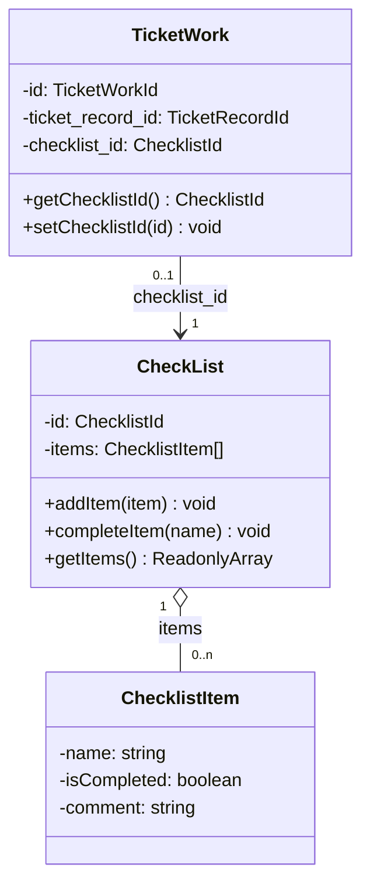

# План: синхронизация `Tickets.Domain` с `work/02-tactical/design.md`

> Контекст: `Tickets/` (NestJS + CQRS + Sequelize + PostgreSQL + RabbitMQ).
> Источник задачи: [`work/02-tactical/design.md`](../work/02-tactical/design.md).
> Язык плана: русский (по AGENTS.md).
> Дата создания: 2026-08-21 (Europe/Moscow, UTC+3).

---

## 0. Контекст и цель

Привести фактический код `Tickets/src/Tickets.Domain/` в соответствие с описанием
[`work/02-tactical/design.md`](../work/02-tactical/design.md). Документ описывает четыре сущностных пункта:

1. `TicketRecord` и `TicketWork` — два коррелирующих агрегата в отношении 1 : n с перекрёстными ссылками по ID
   и двусторонним применением изменений по событиям.
2. `ServiceObject` — сущность (адрес + часы работы); у каждой заявки связь с объектом обслуживания.
3. `CheckList` — сущность с данными о выполнении заявки; `TicketWork` связана с чек-листом.

## 1. Gap-анализ (фактическое состояние кода)

| Пункт design.md | Состояние в коде | Вывод |
| :--- | :--- | :--- |
| 1:n `TicketRecord`↔`TicketWork`, `currentWork()`, инвариант «одна активная работа» | ✅ `works`, `addWork()`, `currentWork()` ([`ticket-record.ts`](../Tickets/src/Tickets.Domain/entities/ticket-record.ts:24)) | согласовано |
| Перекрёстные ссылки по ID (`current_work_id` / `ticket_record_id`) | ✅ поля и геттеры/сеттеры | согласовано |
| `ServiceObject` сущность (адрес + часы) и `service_object_id` у заявки | ✅ [`service-object.ts`](../Tickets/src/Tickets.Domain/entities/service-object.ts:9) | согласовано |
| **`CheckList` сущность + связь `TicketWork` → `CheckList`** | ❌ сущности нет, ссылки нет | **основной разрыв** |

> Примечание: двустороннее применение изменений между агрегатами по событиям и команда переоткрытия заявки
> зафиксированы в [`aggregate.md`](../work/02-tactical/aggregate.md:243) как целевое состояние (дефект №4 «частично»)
> и остаются открытым направлением. Текущая задача закрывает явный разрыв design.md — моделирование `CheckList`.

## 2. Архитектурная схема целевого состояния (модуль CheckList)

## 3. Общие правила выполнения

- Все команды выполняются из каталога `Tickets/` (у контекста собственный `package.json`/`yarn.lock`).
- Проверка качества в `Tickets/`: `yarn build`, `yarn test` (testMatch `**/*.spec.ts`).
- Тесты размещаются рядом с исходником (`*.spec.ts`).
- Доменные сообщения об ошибках — на русском.
- Идентификаторы создаются только через фабрики `XxxId.from(...)` / проверяются `XxxId.isValid(...)`.
- Поля БД/DTO — `snake_case`.

## 4. Подробные шаги (порядок выполнения)

### Шаг 1. Идентификатор `ChecklistId`

В [`entities/identifiers.ts`](../Tickets/src/Tickets.Domain/entities/identifiers.ts) добавить брендовый тип
и фабрику `ChecklistId` (по образцу `TicketWorkId`): `from()` + `isValid()`.

**Критерий готовности:** тип и фабрика существуют, экспортированы.

### Шаг 2. Сущность `CheckList`

Создать `Tickets/src/Tickets.Domain/entities/check-list.ts`:

- Класс `CheckList`:
  - поле `id: ChecklistId`;
  - коллекция `items: ChecklistItem[]`;
  - бизнес-методы: `addItem(item)`, `completeItem(name)` (инвариант: имя должно существовать),
    `getItems(): ReadonlyArray<ChecklistItem>`, `getId()`.
  - публичная фабрика `from(data: ChecklistCreateData & { id: string })` для восстановления по ID
    (по образцу `ServiceObject.from()`).

### Шаг 3. Value Object `ChecklistItem`

Создать `Tickets/src/Tickets.Domain/vo/checklist-item.ts`:

- Класс/интерфейс `ChecklistItem`: `name: string`, `isCompleted: boolean`, `comment?: string`.
- Инвариант: `name` непустая строка.

### Шаг 4. VO `ChecklistCreateData`

Создать `Tickets/src/Tickets.Domain/vo/checklist-create-data.ts`:

- Класс `ChecklistCreateData` с полем `items: ChecklistItem[]`.

### Шаг 5. Связь `TicketWork` → `CheckList`

В [`entities/ticket-work.ts`](../Tickets/src/Tickets.Domain/entities/ticket-work.ts):

- импортировать `ChecklistId`;
- поле `private checklist_id?: ChecklistId;`;
- геттер `getChecklistId(): ChecklistId | undefined`;
- сеттер `setChecklistId(id: ChecklistId): void`;
- в конструкторе: `this.checklist_id = data.checklistId ? ChecklistId.from(data.checklistId) : undefined`.

В [`vo/ticket-work-create-data.ts`](../Tickets/src/Tickets.Domain/vo/ticket-work-create-data.ts):

- добавить поле `checklistId?: string` и приём в конструкторе.

**Критерий готовности:** `TicketWork` хранит/отдаёт ссылку на чек-лист.

### Шаг 6. Юнит-тесты

- `Tickets/src/Tickets.Domain/entities/check-list.spec.ts`:
  - создание с элементами; `addItem` добавляет элемент; `completeItem` помечает выполненным;
  - `completeItem` для отсутствующего имени — ошибка на русском; `getItems` возвращает копию.
- Расширить `Tickets/src/Tickets.Domain/entities/ticket-work.spec.ts`:
  - `setChecklistId`/`getChecklistId` — ссылка на чек-лист; инициализация из `TicketWorkCreateData.checklistId`.

**Критерий готовности:** новые тесты зелёные, существующие не сломаны.

### Шаг 7. Проверка качества

В `Tickets/`: `yarn build && yarn test`.

### Шаг 8. Синхронизация документации

- [`work/02-tactical/design.md`](../work/02-tactical/design.md) — без изменений (это источник).
- [`work/02-tactical/aggregate.md`](../work/02-tactical/aggregate.md) — отметить реализацию `CheckList`
  (раздел 7 дефект №6 → устранено; раздел 2 границы агрегатов — `checklist_id` в `TicketWork`).
- [`work/work-progress.md`](../work/work-progress.md) — обновить разделы 2/3/4/5: этап 2, запись о выполнении,
  закрытие дефекта о чек-листе, следующий шаг.

**Критерий готовности:** документация отражает фактическое состояние кода.

---

## 5. Риски

1. **Blast radius мал**: `TicketWorkCreateData` используется только в домене (entity + spec) —
   добавление необязательного `checklistId` не ломает внешних потребителей.
2. **Степень детализации `CheckList`** не задана в design.md строго («данные о выполнении заявки») —
   принята минимальная модель (пункты-элементы с признаком выполнения); расширяемость обеспечена коллекцией `items`.
3. **Линт**: предсуществующая проблема репозитория (нет ESLint-конфига в `Tickets/`) не связана с изменениями.