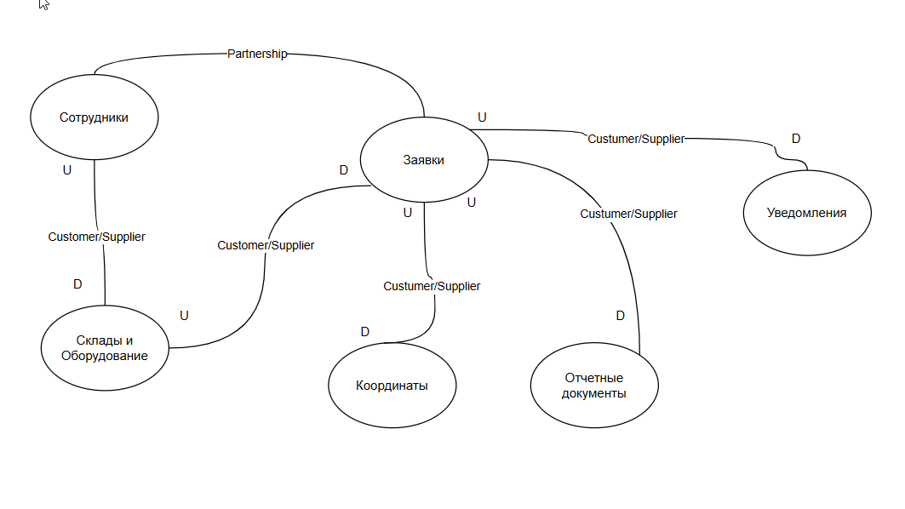
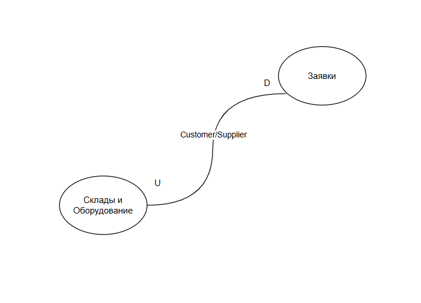
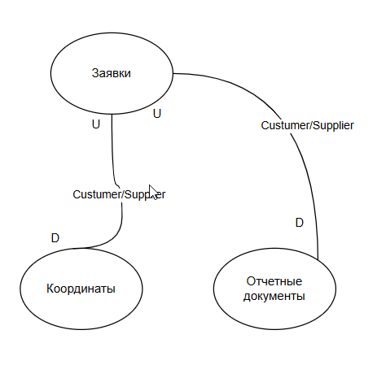

## Ограниченные контексты
| ПодДомен | Ограниченный контекст|
| :--- | :--- |
| Заявки| Заявки |
| Координаты | Координаты |
| Сотрудники | Сотрудники |
| Склады и Оборудование | Склады и Оборудование |
| Уведомления | Уведомления |
| Отчетные документы | Отчетные документы |

**Трактовка одного понятия в различных ограниченных контекстах**

"Заявка" в ограниченном контексте "Заявки" характеризуется как сущность, которая имеет свойства:
- Дата создания
- Статус
- Объект обслуживания
- Назначенный Исполнитель
- Правила выполнения заявки(Сервис, Категория)
- Чек-лист заявки

"Заявка" в ограниченном контексте "Координаты" - это набор координат исполнителя, в процессе работы над заявкой.

"Заявка" в ограниченном контексте "Оборудование" - это список оборудования, которое было установлено или демонтировано в процессе работы над заявкой

"Заявка" в ограниченном контексте "Уведомления" - это набор уведомлений, которые были отправлены пользователю по данной заявке. 

"Заявка" в ограниченном контексте "Отчетные документы" - это набор документов, полученных от исполнителя и сгенерированных по результатам работы над заявкой.

## 4 Карта контекстов

Рассмотрим связь между Заявки и Склады и Оборудование. Здесь используется паттерн Customer/Supplier. Ограниченный контекст Склады и Оборудование является upstream, т.к. диктует свои понятия "Серийное Оборудование"/"Расходные материалы". Ограниченный контекст Заявки является downstream, т.к. зависит от понятий Склады и Оборудование. В процессе работы над Заявкой мы используем оборудование, т.е. зависим от информации из ограниченного контекста Склады и Оборудование.

Рассмотрим связи между Заявки и Координаты. В процессе работы над Заявкой мобильное приложение передает координаты в Систему, которая сохраняет их в ограниченном контексте Координаты. Связь между ограниченными контекстами по паттерну Customer/Supplier. Заявки - upstream, Координаты - downstream. 

Связь между Заявки и  Отчетные документы организована схожим образом. Заявки - upstream, Отчетные документы - downstream. Паттерн Customer/Supplier. В момент закрытия заявки мобильное приложение передает чек-лист выполненных работ и подписи в Систему, которая передает данные в ограниченный контекст Отчетные документы. Внутри ограниченного контекста Отчетные документы генерируется акт и сохраняется в виде файла.

